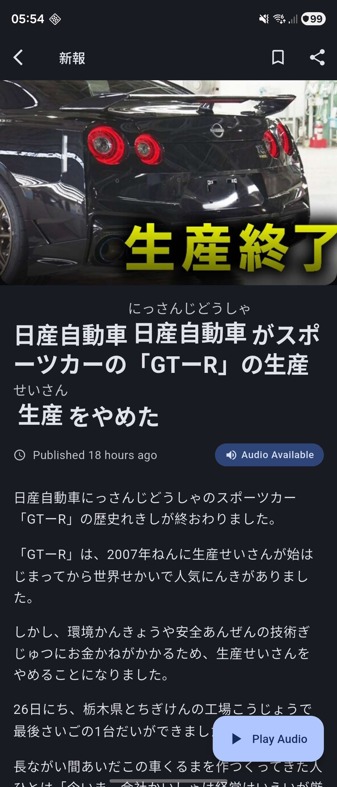

# 新報 (Shinpo)

An unofficial client for [NHK News Web Easy](https://www3.nhk.or.jp/news/easy/).

## Features

- **News Reading**:
  - Ruby text support (furigana annotations) for Japanese text
- **Search Functionality**: Comprehensive search through articles by title and content
  - Real-time search with debouncing
  - Search suggestions based on article titles
  - Date range filtering with calendar picker
- **Bookmarks**: Save and manage your favorite articles
- **Reading History**: Track your reading progress
  - Automatic history tracking
  - Clear history option
  - View previously read articles
- **Audio TTS for articles**
- **Offline Reading**: Cached articles for offline access

## Screenshots

  
  

## License
[MIT](LICENSE)
