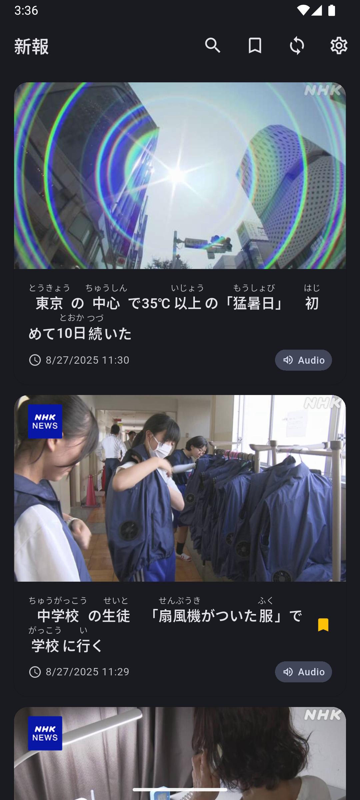
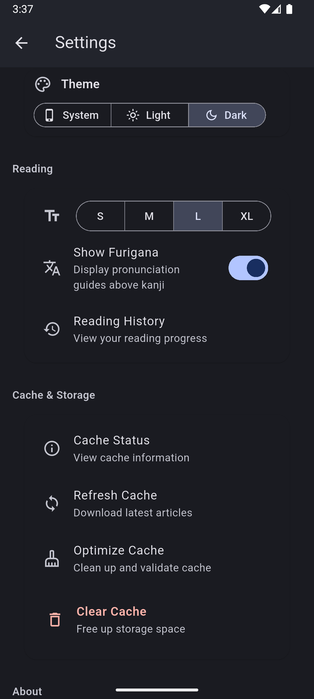
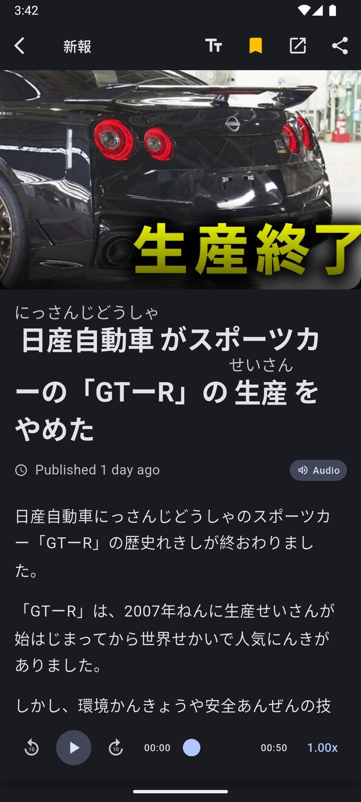

# Shinpo (新報) 

**Unofficial client for NHKやさしいことばニュース | NEWS WEB EASY**  

[Features](#features) • [Screenshots](#screenshots) • [Privacy](./privacy_policy.md) • [License](LICENSE)

## Features

### Reading Experience
- Furigana Support - Ruby annotations for kanji to help learners
- Audio Playback - Listen to articles with text-to-speech
- Offline Reading - Cache articles for reading without internet
- Font Size Control - Adjustable text size for comfortable reading

### Search
- Live Search - Real-time results with debounced input
- Advanced Filtering - Date range selection with calendar picker
- Search Suggestions - Autocomplete and history

### Personal Library
- Bookmarks - Save and organize favorite articles
- Reading History - Automatic tracking with easy access

## Screenshots

<table>
  <tr>
    <td align="center">
      
    </td>
    <td align="center">
      
    </td>
    <td align="center">
      
    </td>
  </tr>
</table>

## Acknowledgements

- [NHK News Web Easy](https://www3.nhk.or.jp/news/easy/) - For providing the news content
- [Frederick-S/Xiaodan Mao](https://github.com/nhk-news-web-easy/nhk-easy-mobile/) - Creator of original repo
